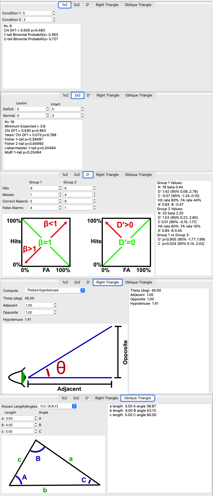

## About

Statilite provides a user interface for computing a few popular formula:

 - 1x2: Chi-Squared and Binomial Probability Calculator calculator to test if two events are occurring with equal frequency.
 - 2x2: Chi-Squared, [Yate's Chi](https://en.wikipedia.org/wiki/Yates%27s_correction_for_continuity), Fisher Exact (fixed marginals) and Liebermeister measures for 2x2 contingency tables.
 - D': [D-prime](http://phonetics.linguistics.ucla.edu/facilities/statistics/dprime.htm) signal detection analysis to measure detectability and criterion bias.
 - Right Triangle: Pythagorean theorem.
 - Oblique Triangle: Trigonometric functions for sine, cosine, and tangent (SOHCAHTOA).



## Requirements

The `Releases` link should provide compiled copies for Linux, Windows and MacOS.

## Compiling

 - Download and install [Lazarus](https://www.lazarus-ide.org/).
 - You can open the project with the Lazarus graphical interface, or simply build from the command line:

```
lazbuild  -B statilite.lpr
```

